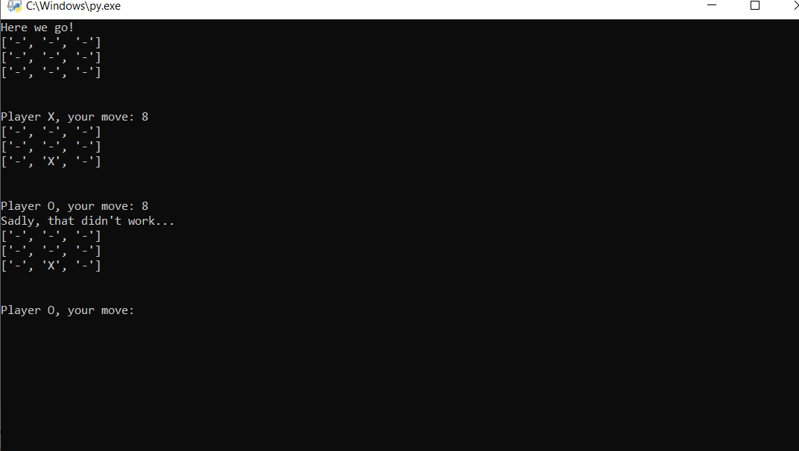

# Tic-Tac-Toe Game with AI

This is a simple implementation of the classic Tic-Tac-Toe game with an AI opponent. The game allows players to play against each other or against the computer AI at varying difficulty levels.

## Features

- Play against another player or against an AI opponent.
- Choose from different difficulty levels for the AI opponent.
- Simple and intuitive user interface.
- Win/loss detection and game outcome determination.
- Option to restart the game or exit the application.

## Requirements

- Python 3.x

## Installation

1. Clone the repository:

   ```bash
   git clone https://github.com/youssefberrk/Tic-Tac-Toe-Game-with-AI.git
   ```

## Usage

1. Navigate to the project directory:

   ```bash
   cd Tic-Tac-Toe-Game-with-AI
   ```

2. Run the game:

   ```bash
   python tic_tac_toe.py
   ```

## Screenshots



## Contributors

- [Youssef Berrk](https://github.com/youssefberrk)

## License

This project is licensed under the MIT License - see the [LICENSE](LICENSE) file for details.
```

